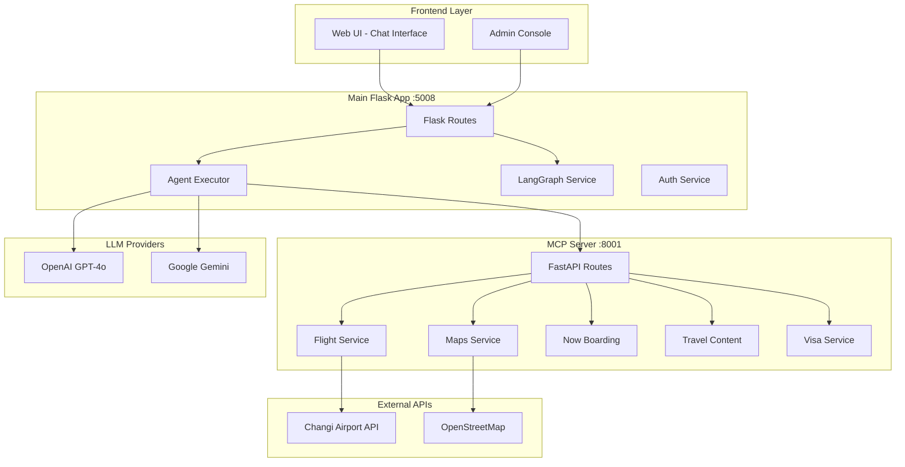
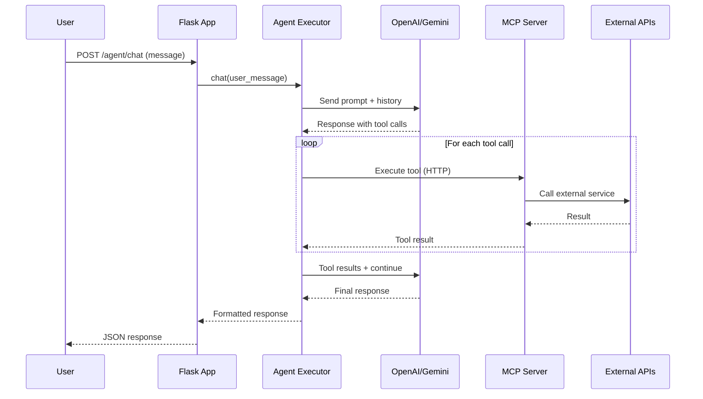

# Changi Travel Assistant - Knowledge Transfer Guide

> **Last Updated:** February 2026  
> This document provides a comprehensive overview of the Travel Assistant platform for onboarding new developers.

---

## Table of Contents

1. [Project Overview](#project-overview)
2. [Architecture Diagram](#architecture-diagram)
3. [Directory Structure](#directory-structure)
4. [Core Components](#core-components)
5. [Application Consoles](#application-consoles)
6. [Data Flow](#data-flow)
7. [Configuration & Environment](#configuration--environment)
8. [Running the Application](#running-the-application)
9. [Key Files Reference](#key-files-reference)

---

## Project Overview

The **Changi Travel Assistant** is an AI-powered travel itinerary planner designed for Changi Airport's Travel Inspiration Hub. It creates personalized travel plans using Large Language Models (LLMs) and integrates with external services for flights, maps, and travel content.

### Key Capabilities

| Feature | Description |
|---------|-------------|
| 🗓️ **AI Itinerary Generation** | Creates detailed day-by-day travel plans |
| ✈️ **Flight Search** | Real-time flight data from Changi Airport API |
| 🗺️ **Maps Integration** | Geocoding and Google Maps URL generation |
| 📰 **Now Boarding Articles** | Singapore travel content from Changi |
| 🌍 **Travel Links** | Lonely Planet & Trip.com booking links |
| 🛂 **Visa Requirements** | Visa info for different nationalities |
| 🔄 **Multi-Agent Workflows** | LangGraph-based agent orchestration |

---

## Architecture Diagram



---

## Directory Structure

```
travel-assistant-updated/
├── app.py                      # 🚀 Main Flask application
├── config.py                   # ⚙️ Configuration settings
├── flight_service.py           # ✈️ Flight search utilities
├── requirements.txt            # 📦 Python dependencies
│
├── agents/                     # 🤖 AI Agent Logic
│   ├── agent_executor.py       # Core agent execution (chat, tool calls)
│   ├── agent_service.py        # Agent CRUD operations
│   ├── langgraph_service.py    # Multi-agent workflow orchestration
│   ├── workflow_service.py     # Workflow CRUD operations
│   └── default_agents.json     # Default agent configurations
│
├── auth/                       # 🔐 Authentication
│   └── auth_service.py         # Session-based auth with login decorator
│
├── llm/                        # 🧠 LLM Providers
│   ├── llm_factory.py          # Factory for creating LLM clients
│   ├── openai_provider.py      # OpenAI GPT integration
│   └── gemini_provider.py      # Google Gemini integration
│
├── mcp/                        # 🔧 MCP Tool Management (Client-side)
│   ├── mcp_manager.py          # Executes MCP tools via HTTP
│   └── tool_registry.py        # Available tool definitions
│
├── mcp-server/                 # 🔌 MCP Server (FastAPI) :8001
│   ├── server.py               # Main FastAPI server
│   └── services/               # Tool implementations
│       ├── flight_service.py   # Flight search from Changi API
│       ├── maps_service.py     # Geocoding & maps
│       ├── nowboarding_service.py  # Changi articles
│       ├── travel_content_service.py  # Lonely Planet/Trip.com links
│       └── visa_service.py     # Visa requirements
│
├── prompts/                    # 📝 System Prompts
│   ├── prompt_loader.py        # Loads prompt files
│   ├── travel_assistant.txt    # Main travel assistant prompt
│   └── roaming_assistant.txt   # Roaming plans prompt
│
├── storage/                    # 💾 JSON Data Storage
│   ├── agents.json             # Agent configurations
│   ├── workflows.json          # Workflow definitions
│   └── users.json              # User credentials
│
├── templates/                  # 🖼️ HTML Templates
│   ├── index.html              # Chat interface
│   ├── admin.html              # Admin dashboard
│   └── login.html              # Login page
│
├── static/                     # 📁 Static Assets
│   ├── style.css               # Main styles
│   └── script.js               # Frontend JavaScript
│
└── admin-console-standalone/   # 📊 Standalone Admin (alternative)
```

---

## Core Components

### 1. Agent Executor (`agents/agent_executor.py`)

The brain of the application. Handles:

- **Chat conversations** with LLM (OpenAI/Gemini)
- **Tool call processing** - Detects and executes MCP tool calls
- **Itinerary generation** - Converts LLM responses to HTML
- **Context management** - Maintains conversation history

```python
# Key methods:
executor = AgentExecutor(agent_id="travel-bot-default")
response = executor.chat("Plan a 5-day trip to Tokyo")
# Streaming:
for chunk in executor.chat_stream("Where should I travel?"):
    print(chunk)
```

### 2. LangGraph Service (`agents/langgraph_service.py`)

Enables **multi-agent workflows** where multiple agents work together:

- **Orchestrator nodes** - Route requests to specialized agents
- **Agent nodes** - Individual agents in the workflow
- **Conditional routing** - Dynamic path selection based on state

```python
# Workflow execution:
result = langgraph_service.execute_workflow(
    workflow_id="workflow-123",
    user_message="I need visa info and an itinerary"
)
```

### 3. MCP Manager (`mcp/mcp_manager.py`)

Bridges agents with external tools via HTTP:

- Calls MCP server endpoints
- Handles tool responses
- Logs tool execution

**Available MCP Tools:**

| Tool ID | Functions | Description |
|---------|-----------|-------------|
| `flight_api` | `search`, `format` | Search & format flights |
| `nowboarding` | `fetch_articles` | Get Changi articles |
| `maps` | `geocode`, `generate_url`, `extract_locations` | Maps & locations |
| `travel_content` | `lonely_planet_url`, `trip_com_url`, `destination_links` | Booking links |
| `visa` | `get_requirements` | Visa information |

### 4. LLM Factory (`llm/llm_factory.py`)

Creates LLM provider instances based on configuration:

```python
# Usage:
client = LLMFactory.create_llm_client(
    provider="openai",  # or "gemini"
    model="gpt-4o"
)
```

---

## Application Consoles

### Console 1: Chat Interface (Port 5008)

**URL:** `http://localhost:5008`

The main user-facing interface for travel planning:

- Natural language chat with AI
- Itinerary display panel
- Flight options
- Interactive maps

**Key Routes:**
- `GET /` - Redirect to default agent
- `GET /agent/<agent_id>` - Agent chat page
- `POST /agent/<agent_id>/chat` - Send message API
- `GET /workflow/<workflow_id>` - Workflow chat page

### Console 2: Admin Dashboard (Port 5008)

**URL:** `http://localhost:5008/admin`

Protected admin area for managing the platform:

- **Agents Tab** - Create/edit/delete AI agents
- **Prompts Tab** - Modify system prompts
- **Workflows Tab** - Build multi-agent workflows
- **MCP Tools Tab** - View available tools

**Default Login:** `admin` / `admin`

### Console 3: MCP Server (Port 8001)

**URL:** `http://localhost:8001`

FastAPI server exposing tools as HTTP endpoints:

- `GET /health` - Health check
- `POST /search` - Flight search
- `POST /articles` - Now Boarding articles
- `POST /geocode` - Location geocoding
- `POST /visa/requirements` - Visa info

---

## Data Flow

### Chat Request Flow



### Workflow Execution Flow

1. User message arrives at workflow endpoint
2. LangGraph compiles workflow from JSON definition
3. **Orchestrator agent** analyzes request
4. Routes to appropriate **specialist agents**
5. Each agent processes and returns results
6. Final response aggregated and returned

---

## Configuration & Environment

### Environment Variables

Copy `.env.example` to `.env` and configure:

```bash
# Required - At least one LLM API key
OPENAI_API_KEY=sk-...
GEMINI_API_KEY=AIza...

# Optional - Server settings
PORT=5008
DEBUG=true
MCP_SERVER_URL=http://localhost:8001

# Optional - Changi API
CHANGI_API_KEY=your_key
```

### Storage Files

| File | Purpose |
|------|---------|
| `storage/agents.json` | Agent configurations (name, model, tools, prompts) |
| `storage/workflows.json` | Multi-agent workflow definitions |
| `storage/users.json` | Admin user credentials |

---

## Running the Application

### Prerequisites

- Python 3.8+
- OpenAI or Gemini API key

### Quick Start

```bash
# 1. Install dependencies
python -m venv venv
source venv/bin/activate
pip install -r requirements.txt

# 2. Configure environment
cp .env.example .env
# Edit .env with your API keys

# 3. Start MCP Server (Terminal 1)
cd mcp-server
python server.py
# Runs on http://localhost:8001

# 4. Start Flask App (Terminal 2)
python app.py
# Runs on http://localhost:5008

# 5. Open in browser
open http://localhost:5008
```

---

## Key Files Reference

### Entry Points

| File | Purpose | Command |
|------|---------|---------|
| `app.py` | Main Flask application | `python app.py` |
| `mcp-server/server.py` | MCP tool server | `python mcp-server/server.py` |

### Configuration

| File | Purpose |
|------|---------|
| `config.py` | App configuration from env vars |
| `.env.example` | Environment variable template |
| `requirements.txt` | Python dependencies |

### Core Logic

| File | What It Does |
|------|--------------|
| `agents/agent_executor.py` | Chat handling, tool execution, response formatting |
| `agents/langgraph_service.py` | Multi-agent workflow orchestration |
| `llm/llm_factory.py` | LLM provider creation |
| `mcp/mcp_manager.py` | Tool execution via HTTP |

### Templates & UI

| File | Page |
|------|------|
| `templates/index.html` | Chat interface |
| `templates/admin.html` | Admin dashboard |
| `templates/login.html` | Login page |

---

## Common Tasks

### Adding a New Agent

1. Go to Admin (`/admin`)
2. Click "Create Agent"
3. Configure:
   - Name & description
   - LLM provider (OpenAI/Gemini)
   - Model (gpt-4o, gemini-2.5-flash, etc.)
   - MCP tools to enable
   - System prompt or prompt file

### Creating a Workflow

1. Go to Admin → Workflows
2. Click "Create Workflow"
3. Add nodes (orchestrator + agents)
4. Connect nodes with edges
5. Save and compile

### Adding a New MCP Tool

1. Create service in `mcp-server/services/`
2. Add endpoint in `mcp-server/server.py`
3. Register in `mcp/tool_registry.py`
4. Update `mcp/mcp_manager.py` endpoint map

---

## Troubleshooting

| Issue | Solution |
|-------|----------|
| MCP tools not working | Ensure MCP server is running on port 8001 |
| LLM errors | Check API keys in `.env` |
| Login fails | Default: `admin`/`admin`, or check `storage/users.json` |
| No flights found | Verify `CHANGI_API_KEY` is set |

---

## Contact & Support

For questions about this codebase, contact the original development team or refer to the additional documentation files:

- `README.md` - Project overview
- `MCP_SETUP.md` - MCP server setup
- `FLIGHT_INTEGRATION_GUIDE.md` - Flight API details
- `ITINERARY_PLANNER_GUIDE.md` - Itinerary generation

---

*This document was created for knowledge transfer purposes. Keep it updated as the codebase evolves.*
