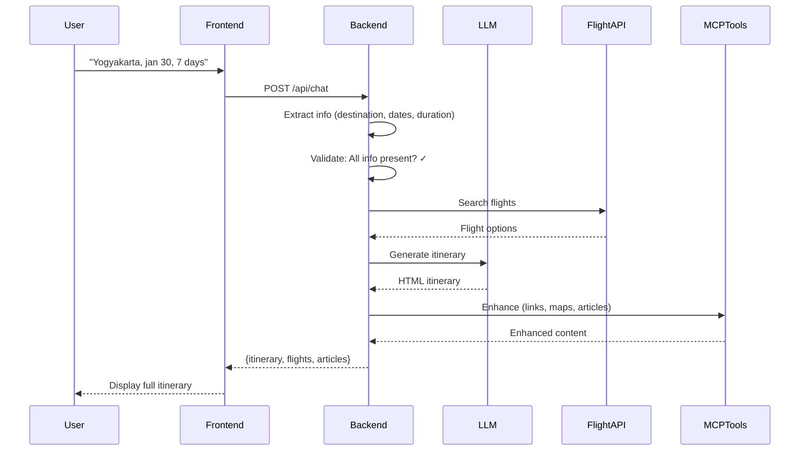
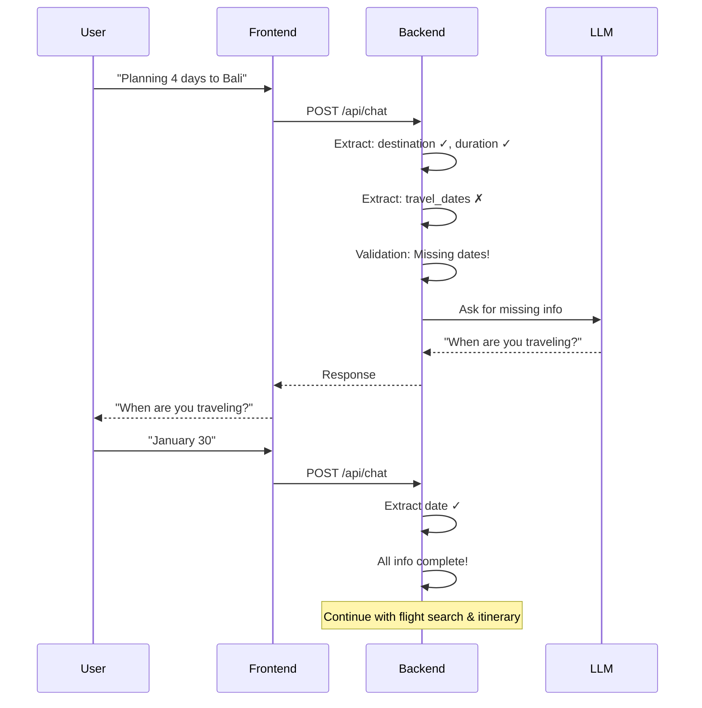
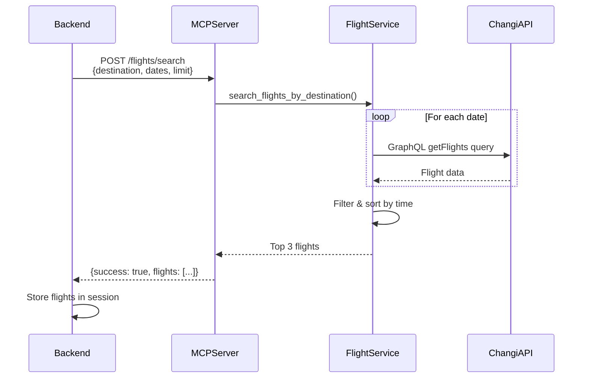
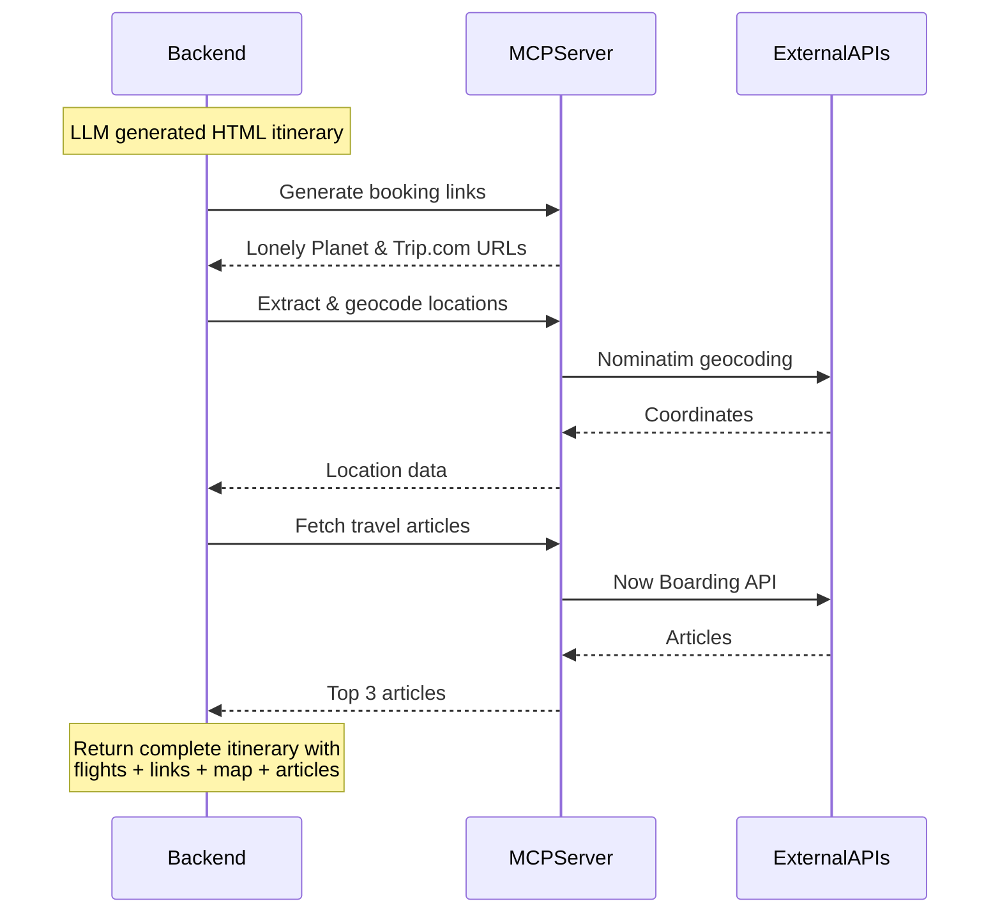
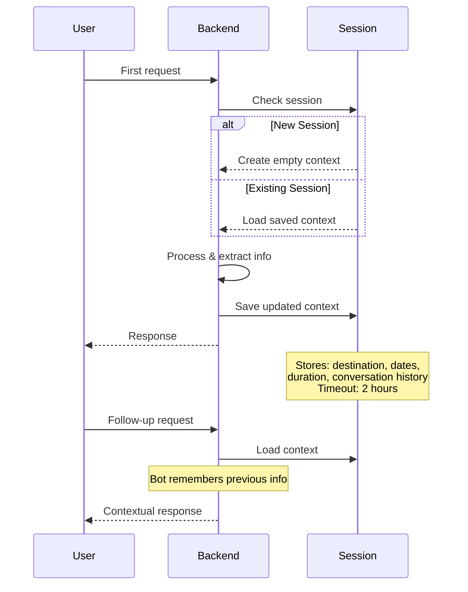

# Changi Travel Assistant - Sequence Diagrams

## 1. Complete Travel Itinerary Generation Flow



## 2. Missing Information Flow



## 3. Flight API Integration



## 4. Content Enhancement Flow



## 5. Session Management



## Validation Rules

### Information Extraction
1. **Destination** → Check against Southeast Asia list
2. **Duration** → Extract from patterns like "3 days", "5 day"
3. **Travel Dates** → Parse formats like "Jan 30", "January 21, 2025"

### Validation Checkpoints
- ✅ **has_destination**: Destination extracted from message
- ✅ **has_duration**: Duration extracted and saved
- ✅ **has_travel_dates**: Valid dates (not empty list/null)
- ✅ **has_all_info**: All three present → Trigger flight search

### Flight Search Conditions
```
needs_flight_search = (
    has_destination AND
    has_duration AND
    has_travel_dates AND
    NOT already_searched
)
```

## Key Components

| Component | Responsibility |
|-----------|---------------|
| **Frontend** | User interface, API calls |
| **Backend** | Orchestration, validation, extraction |
| **LLM (Gemini)** | Natural language understanding, itinerary generation |
| **FlightAPI** | Search Changi Airport flights |
| **MCPTools** | Content enhancement (links, maps, articles) |
| **Session** | Context persistence (2-hour timeout) |
